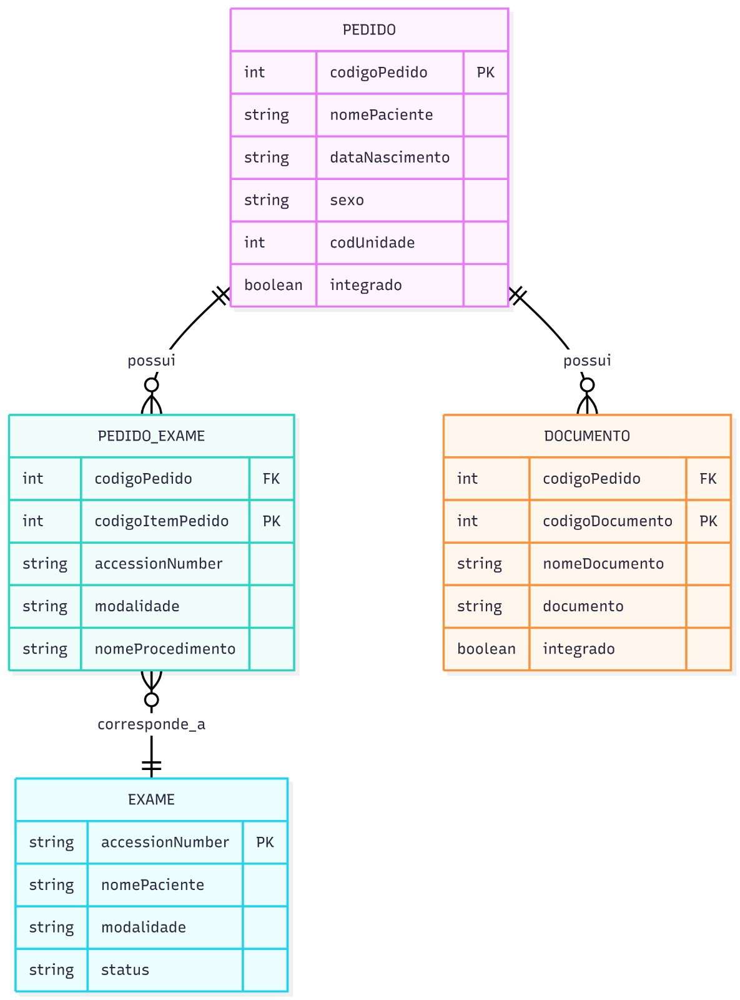

📌 
# Desafio Técnico - Integração de Pedidos, Exames e Documentos

API backend desenvolvida para integrar pedidos médicos, exames e documentos, simulando um cenário real de sistemas distribuídos na área da saúde, " integrações entre sistemas hospitalares e uma plataforma de telemedicina".

⚙️ 2. Tecnologias utilizadas

## Tecnologias

- Node.js
- NestJS
- MongoDB
- Mongoose
- Docker
- Swagger (documentação)

💡 explicação rápida:

O NestJS foi escolhido por fornecer uma arquitetura modular e organizada.

O MongoDB foi utilizado pela flexibilidade no armazenamento de dados relacionados.

O Mongoose foi utilizado como ODM para facilitar a modelagem e manipulação dos dados.

🚀 3. Como rodar o projeto


## Como executar

### Pré-requisitos

- Node.js
- Docker

### Instalação

```bash
npm install
```

### Rodando o projeto

```bash
npm run start:dev
```

### Rodando com Docker

```bash
git clone https://github.com/GuhSousa2002/desafio-integracao.git
cd desafio-integracao
docker compose up --build

```

---

📡 4. Endpoints da API

## Endpoints

- POST /pedidos
- POST /documentos
- POST /exames

- GET /pedidos/:codigoPedido
- GET /documentos/:codigoPedido
- GET /exames/:accessionNumber


🧠 5. Regras de negócio 


## Regras de negócio

- Pedido é salvo pelo CodigoPedido
- Exames não podem ser duplicados dentro do pedido
- Documento é único por CodigoDocumento + CodigoPedido
- Integração ocorre via AccessionNumber

🏗️ 6. Estrutura do projeto


## Estrutura do projeto

A aplicação foi organizada seguindo o padrão modular do NestJS:

- Controllers: responsáveis pelas rotas da API
- Services: regras de negócio
- Repositories: acesso ao banco de dados
- DTOs: validação e padronização dos dados de entrada
- Schemas: definição das entidades no MongoDB

referência:
https://docs.nestjs.com/openapi/introduction#document-options
https://docs.nestjs.com/modules
https://docs.nestjs.com/controllers
https://docs.nestjs.com/techniques/mongodb
https://docs.nestjs.com/deployment

🧩 7. Decisões técnicas 


## Decisões técnicas

Inicialmente, foi realizado o desenho do banco de dados e suas cardinalidades, o que permitiu uma melhor visualização e entendimento do problema.

Com base nisso, foi escolhido o MongoDB devido à flexibilidade no armazenamento de documentos relacionados.

O Mongoose foi utilizado para modelar os schemas e facilitar a manipulação dos dados.

A estrutura foi organizada em camadas (controller, service e repository) para manter separação de responsabilidades.

Os DTOs foram utilizados para garantir a padronização dos dados recebidos nos endpoints.

O fluxo de desenvolvimento seguiu na seguinte ordem:

1. Modelagem do banco
2. Definição das entidades (schemas)
3. Criação dos DTOs
4. Implementação das regras de negócio (services)
5. Exposição dos endpoints (controllers)
6. Testes e documentação (Swagger)
7. Containerização com Docker

🧪 8. Testes

## Testes

Os testes foram implementados para validar os principais cenários do desafio.

Para rodar todos os testes:

```bash
npm test -- --runInBand
```

Para rodar por módulo:

```bash
npm test -- modules/pedidos --runInBand
npm test -- modules/documentos --runInBand
npm test -- modules/exames --runInBand
```

📚 9. Documentação (Swagger)

## Documentação

A documentação da API pode ser acessada em:

```txt
http://localhost:3000/api-docs
```


🖼️ 10. Modelagem

## Modelagem de dados

Essa imagem foi criada com a ideia de organizar os dados do projeto:



 
❌ 11. NÃO FOI FEITO:

parsing real de DICOM
HL7 real
autenticação
mensageria
integração real com AWS
front-end
regra de usaCodigoPedido
exames complementares
concorrência real
storage real de anexos
regras avançadas do fluxo original


O README foi estruturado para garantir clareza na execução do projeto e evidenciar as decisões técnicas adotadas durante o desenvolvimento.
